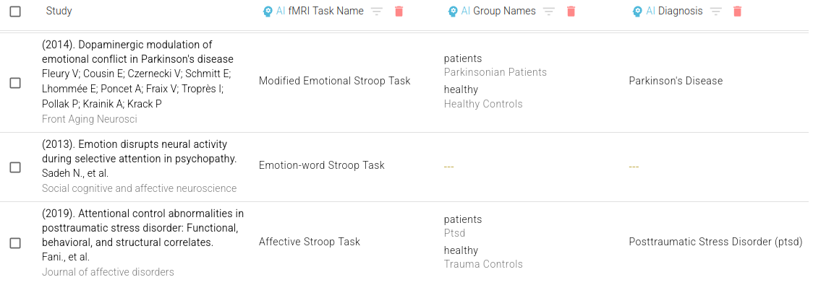
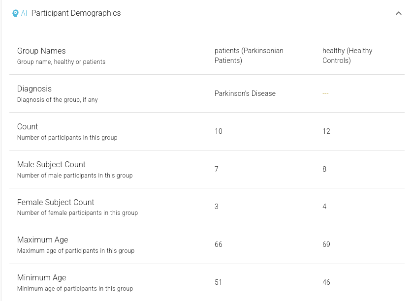
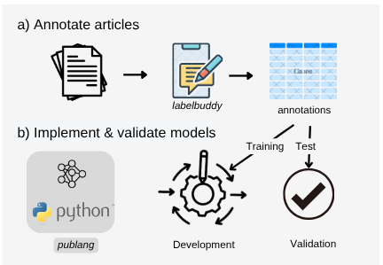

# **Introducing AI-Assisted Curation**

We’re excited to share the release of a significant new innovation in Neurosynth Compose: **AI-Assisted Curation**. This new feature aims to simplify and accelerate custom neuroimaging meta-analyses, making it easier than ever to curate a set of studies for inclusion into a quantitative meta-analysis.

Traditionally, reviewing studies for inclusion in a meta-analysis takes hundreds of hours, even with a user-friendly interface. The original Neurosynth platform helped by using text mining to group studies by keywords, but extracting crucial details—like participant demographics or task design—remained a challenge because such information is inconsistently reported.

With Large Language Models (LLMs) and zero-shot learning, we can now automatically extract structured study information directly from full-text articles. This a key step towards **precise, automated neuroimaging meta-analysis**.

## **LLMs for Neuroscientific Information Extraction**

Historically, developing AI models for information extraction required a large number of annotated examples required for training, making it impossible to apply in low-data fields like neuroimaging. However, modern LLMs can interpret scientific text without extensive domain-specific training. It is now possible to  automatically extract information from articles, even in areas where there are very few existing human-labeled examples. This approach, called "**zero-shot learning**", means modern LLMs can extract information without task-specific training.

By prompting LLMs carefully, we can extract verifiable details—like sample size, diagnosis, age range, tasks, and modalities—from more than 30,000 studies in the NeuroStore database. These details are displayed during curation, making it easier to compare studies and decide which to include.

Figure 1\. High-level overview of Zero Shot Information Extraction using LLM prompting

## **A New Curation Experience**

This information is presented in two key places within the revamped curation user interface: a **concise table view**, allowing for easy comparison across papers, and more **detailed individual study pages** where you can delve deeper into the extracted specifics for a single paper. 

This supports a faster, PRISMA-compliant screening and eligibility process, all within a web-based interface.

Figure 2\. Table view showing AI-extracted information (Task Name, Group names, Diagnosis), across three studies

By clicking on a row in the table view, you can see detailed study-level extracted information:

Figure 3\. Detailed study-evel AI-extracted information, showing Participant Demographics.

## **Validated, Iterative Development**
Unlike general-purpose review tools (e.g., Elicit, Perplexity, Google Notebook LM), our approach is grounded in *domain expert neuroimaging guidelines*. First, we developed expert-driven extraction schemas for neuroimaging. Next, each schema is validated by comparing AI outputs with manual annotations (treated as the gold standard), ensuring accuracy before release. 

Figure 4\. Iterative annotation and prompt development workflow. 

**This ongoing effort is open to community feedback.** The goal is to continuously refine and check our extraction guidelines for neuroimaging-specific study information that help researchers find and screen studies for inclusion into meta-analysis.

Annotated studies are sourced from PubMed Central using *pubget* and annotated using *labelbuddy*— a set of tools recently introduced by our group for literature mining (Dockes et al., 2024). 

Annotations are openly accessible in the [labelbuddy annotations GitHub repository](https://github.com/litmining/labelbuddy-annotations/), and [extraction pipelines](https://github.com/neurostuff/neurostore-text-extraction/tree/main/ns\_extract/pipelines) are also made available for transparency.

## **Initial Extraction Schemas**

At launch, we support two schemas: *participant demographics* and *experimental details.*, extracted from the full text of articles using GPT-4—

### 1. **Participant Demographics**

Extracts demopgrahic details separately for each participant group:

| Field | Description |
| ----- | ----- |
| `count` | Total participants in the group (exclude dropouts). |
| `diagnosis` | Exact clinical/medical diagnosis, including subtypes and comorbidities. |
| `group_name` | Group type: `"healthy"` (controls) or `"patients"` (clinical). |
| `subgroup_name` | Verbatim group name, if provided. |
| `male_count` | Number of males, if explicitly reported. |
| `female_count` | Number of females, if explicitly reported. |
| `age_mean` | Mean age, if stated directly in the text. |
| `age_range` | Age range as stated (e.g., `"18-65"`); use dash format. |
| `age_minimum` | Lowest age reported or lower bound of range. |
| `age_maximum` | Highest age reported or upper bound of range. |
| `age_median` | Median age, only if explicitly provided. |

Validation on 220 articles showed high accuracy, especially for participant counts (<15% error) and diagnosis classification (>0.8 F1-score using BERTScore, on subset of 100 studies with annotated *diagnosis*). Qualitative analysis confirmed that LLMs are increasingly adept at capturing specific diagnostic information (e.g., "Autism Spectrum Disorder", "phobic prone", "eating disorders prone") and associating them correctly with relevant demographic data, even if the specific form differed from the manual annotation. 

### 2. **Experimental Details**

Captures study design and task information:

| Field | Description |
| ----- | ----- |
| `Modality` | Imaging modalities used (e.g., "fMRI-BOLD", "MEG", "PET"). |
| `StudyObjective` | Brief summary of the study’s main research question or goal. |

For each fMRI task presented within the study, the following was also extracted:

| Field | Description |
| ----- | ----- |
| `TaskName` | Exact task name as stated in the text; if not named,  provide brief description. |
| `TaskDescription` | 1–2 sentence summary of instructions, stimuli, measures, and objectives. |
| `DesignDetails` | Detailed design: type, timing, structure, presentation, response methods. |
| `Conditions` | All experimental and control conditions mentioned. |
| `TaskMetrics` | All measured outcomes: behavioral, neural, and subjective. |
| `Concepts` | Specific mental/cognitive concepts explicitly mentioned. |
| `Domain` | Primary cognitive domains engaged, if stated. |
| `RestingState` | True only if described explicitly as a resting-state scan. |
| `RestingStateMetadata` | Rest-specific details: duration, instructions, eyes open/closed, etc. |
| `TaskDesign` | Task design type(s): Blocked, EventRelated, Mixed, or Other. |
| `TaskDuration` | Total task duration (e.g., "10 minutes" or "600 seconds"). |

Validation on 104 studies found high accuracy for modality and resting-state fields (94%) and strong performance for task information (1-Levenshtein distance of 0.9), particularly when task names were clearly reported in the original sudies (64% of studies). For studies without a clearly defined task name, qualitative review indicated GPT often provided a coherent and plausible description of the task based on the provided context.

This preliminary validation is just a first step. Stay tuned for a more comprehensive evaluation of AI-extracted neuroimaging features\!

# **Get Started**

You can try AI-Assisted Curation now at [compose.neurosynth.org](https://compose.neurosynth.org).

This is an ongoing project: we’ll keep expanding schemas and refining accuracy. We welcome your feedback and ideas—join the conversation on [NeuroStars](https://neurostars.org/tag/neurosynth-compose), our discussion forum.  
