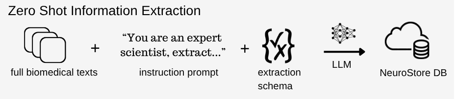

# **Introducing AI-Assisted Curation**

We’re excited to share the release of a significant new innovation in Neurosynth Compose: **AI-Assisted Curation**. This new feature aims to simplify and accelerate custom neuroimaging meta-analyses, making it easier than ever to curate a set of studies for inclusion into a quantitative meta-analysis.

As Neurosynth Compose users well know, even with the help of a streamlined user interface, manually reviewing studies for inclusion into a meta-analysis is very time-consuming. In fact, a single systematic review can take hundreds of hours, which severely limits the kinds of research questions we can explore. For this very reason, the original Neurosynth platform, which used text-mining to group neuroimaging studies by keywords or topics, was a big step forward. However, the low hanging fruit from these methods have largely been picked. Additionally, crucial details about how a study was done or who participated (like sample size, age, patient group, and experimental specifics) are hard to extract automatically using simple methods such as text frequency or heuristics because they're often described inconsistently or not mentioned frequently in the text.

Here, we aimed to leverage innovations in Zero-Shot Learning using Large Language Models (LLMs) and pair this with our platform for custom meta-analysis (Neurosynth Compose) to **make precise, automated meta-analysis of neuroimaging literature a reality.**

## **Large Language Models (LLMs) for Neuroscientific Information Extraction**

At the heart of this effort is the recent ability for LLMs to understand language with little specialized training. Historically, developing AI models for scientific information extraction was difficult due to the large number of annotated examples required for training. For low-annotation fields like neuroimaging, that largely meant that state-of-the-art biomedical NLP models were out of reach.

However, recent advancements in **LLM transfer learning** have made it possible to automatically extract information from articles, even in areas where there are very few existing human-labeled examples. Newer LLMs that are trained on vast amounts of general text can be prompted to learn new information with no training data. This approach called "**zero-shot learning**" means SOTA LLMs can extract information even if they haven't seen that exact type of task before.

Here, we use these models to **extract specific details directly from the full text of over 30,000 neuroimaging studies indexed in the NeuroStore database**. By carefully guiding the AI to focus on verifiable facts within the paper, we can reduce the chance of hallucinations, and allow us to verify how accurately key details are extracted. Using this information, we can build a large, structured collection of neuroscientific facts—including participant demographics, study designs, task information, and more—which is then seamlessly presented to you during the curation stage.

Figure 1\. High-level overview of Zero Shot Information Extraction using LLM prompting

## **A Revamped Curation Experience**

This information is presented in two key places within the revamped curation user interface: a **concise table view**, allowing for easy comparison across papers, and more **detailed individual study pages** where you can delve deeper into the extracted specifics for a single paper. This dramatically facilitates systematic literature review and helps you efficiently screen studies for eligibility into your meta-analysis research question, all within a fully web-based, PRISMA-compliant workflow (Note that for the PRISMA-workflow AI features are available in the Screening and Eligibility phases).

Figure 2\. Table view showing AI-extracted information (Task Name, Group names, Diagnosis), across three studies

By clicking on a row in the table view, you can see study-level meta-data and extracted features in more detail:

Figure 3\. Detailed study-evel AI-extracted information, showing Participant Demographics.

## **Iterative Approach to Validation and Development**

Our approach to information extraction is specifically focused on study details relevant for neuroimaging meta-analysis. We have developed specific extraction schemas that capture the nuanced details crucial for meta-analysis in this field. For each set of guidelines, a sample of studies is manually reviewed and tagged, and the automated extractions are checked for accuracy against these manual tags, both by numbers and by human review. This thorough process makes sure that when new extraction features are introduced to the platform, a reasonable level of accuracy can be established. In contrast with domain-general automated literature review platform and deep review platforms (e.g Elict, Perplexity, Google Notebook LM), the specific extraction schemas have been validation and aligned with expert-guided knowledge representations. 

Figure 4\. Iterative annotation and prompt development workflow. 

**This effort is an ongoing process that is open to community feedback.** The goal is to continuously refine and check our extraction guidelines for neuroimaging-specific study information that help researchers find and screen studies for inclusion into meta-analysis. This extracted data can then be used with the rest of our existing comprehensive meta-analysis ecosystem (i.e. Neurosynth Compose & NiMARE), to perform detailed meta-analyses. 

All of the studies annotated for Neurosynth Compose are sourced from PubMed Central using *pubget* and annotated using *labelbuddy*— a set of tools our group recently introduced by our group for literature mining (Dockes et al., 2024). All of the annotations we have generated are openly accessible under the [labelbuddy annotations GitHub repository](https://github.com/litmining/labelbuddy-annotations/)

The extraction pipelines that are validated and iteratively developed using these annotations (and put into production on Neurosynth Compose), are also [openly available](https://github.com/neurostuff/neurostore-text-extraction/tree/main/ns\_extract/pipelines).

## **Initial Extraction Schemas**

At launch, we have extracted two schemas across the articles indexed by NeuroStore: *participant demographics* and *experimental details.* To begin, these schemas were extracted from the full text of articles using GPT-4— a model we previously established performed well at information extraction. 

### **Participant Demographics**

Participant demographics were extracted for each experimental group in the study. LLM models were instructed to focus on values that were *explicitly* mentioned in the text

| Field | Description |
| ----- | ----- |
| `count` | Total participants in the group (exclude dropouts). |
| `diagnosis` | Exact clinical/medical diagnosis, including subtypes and comorbidities. |
| `group_name` | Group type: `"healthy"` (controls) or `"patients"` (clinical). |
| `subgroup_name` | Verbatim group name, if provided. |
| `male_count` | Number of males, if explicitly reported. |
| `female_count` | Number of females, if explicitly reported. |
| `age_mean` | Mean age, if stated directly in the text. |
| `age_range` | Age range as stated (e.g., `"18-65"`); use dash format. |
| `age_minimum` | Lowest age reported or lower bound of range. |
| `age_maximum` | Highest age reported or upper bound of range. |
| `age_median` | Median age, only if explicitly provided. |

**Preliminary Validation.** 
- We annotated over 220 articles for participant demographics. 
- We observed a high level of accuracy for most fields, notably for participant *count* (\<0.15 Mean Percentage Error). 
- In our annotated sample, we identified 100 individual  participant groups with a *diagnosis* labels (e.g. “schizophrenia”). Using BERTScore to quantitatively compare the extracted and annotated diagnoses, the best performing models achieved >0.8 F1-score, indicating moderate to high accuracy. (higher scores are better). 
- Qualitative analysis confirmed that LLMs are increasingly adept at capturing specific diagnostic information (e.g., "Autism Spectrum Disorder", "phobic prone", "eating disorders prone") and associating it correctly with relevant demographic data, even if the specific form differed from the manual annotation. 

### **Experimental Details**

The goal of this schema was to extract key details of the overall study, and the individual fMRI Tasks that were used. 

For the overall study, the following was extracted:

| Field | Description |
| ----- | ----- |
| `Modality` | Imaging modalities used (e.g., "fMRI-BOLD", "MEG", "PET"). |
| `StudyObjective` | Brief summary of the study’s main research question or goal. |

For each fMRI task presented within the study, the following was extracted:

| Field | Description |
| ----- | ----- |
| `TaskName` | Exact task name as stated in the text; if not named,  provide brief description. |
| `TaskDescription` | 1–2 sentence summary of instructions, stimuli, measures, and objectives. |
| `DesignDetails` | Detailed design: type, timing, structure, presentation, response methods. |
| `Conditions` | All experimental and control conditions mentioned. |
| `TaskMetrics` | All measured outcomes: behavioral, neural, and subjective. |
| `Concepts` | Specific mental/cognitive concepts explicitly mentioned. |
| `Domain` | Primary cognitive domains engaged, if stated. |
| `RestingState` | True only if described explicitly as a resting-state scan. |
| `RestingStateMetadata` | Rest-specific details: duration, instructions, eyes open/closed, etc. |
| `TaskDesign` | Task design type(s): Blocked, EventRelated, Mixed, or Other. |
| `TaskDuration` | Total task duration (e.g., "10 minutes" or "600 seconds"). |

**Preliminary Validation** 

We annotated 104 papers to validate study/task information, with the majority of these papers sourced from the NeuroVault collection. 

* **Modality & RestingState:** Modality and Resting State fields demonstrated very high accuracy. For instance, with 94% accuracy for these fields using GPT 4\.  
* **TaskName and TaskDescription Accuracy:** TaskName is accurate for studies with a clearly defined task name (64/104 of studies), with a score of 0.9 (1-Levenshtein distance). For studies without a clearly defined task name, qualitative review of examples, showed that the models often provided a coherent and plausible description of the task based on the provided context, even if it wasn't a direct match to a predefined label.

This preliminary validation is just a first step. Stay tuned for a more comprehensive evaluation of AI-extracted neuroimaging features\!

# **Try AI-Assisted Curation now\!**

These new features are available for you to try out now on [compose.neurosynth.org](https://compose.neurosynth.org).

Remember, this is an ongoing, iterative effort, and we have many more features planned on the horizon to increase the level of accuracy and transparency of these AI-extracted features. Feel free to suggest features that would be useful for us to extract. 

We're always looking for ways to improve Neurosynth Compose, and your feedback is incredibly valuable\! If you have thoughts, questions, or suggestions about AI-Assisted Curation or any other feature, please don't hesitate to reach out. You can also engage with us and the broader community on [NeuroStars](https://neurostars.org/tag/neurosynth-compose), our discussion forum.  